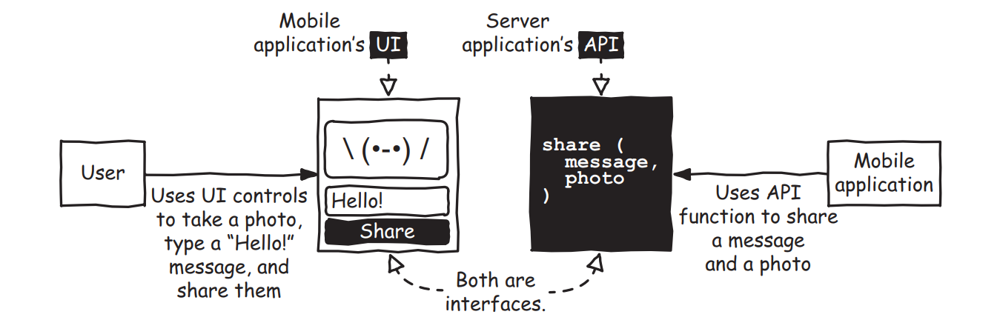
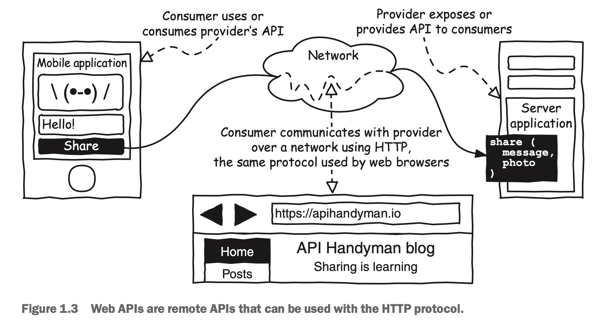

### 1.1.1 API就是给软件提供的网络接口

在本书中，API就指的给软件提供的是网络API。一个API无论是什么属性，最重要的是一个为两个系统、主题、组织以及类似场景的互通相连提供的接口。API的概念一开始可能没那么容易理解，图1.2通过与应用程序和UI界面的比较API显得更加具体一些。

对于手机应用的用户来说，是通过触摸屏幕上展示的应用界面的方式与智能手机进行互动的。一个移动应用的UI界面应该提供最基础的组件例如按钮、文本输入框、以及各种标签。这些组件让用户在与应用交互式能收到实时的反馈，或者触发分享信息或是照片。

在我们使用应用程序UI来与应用程序交互时，当前的应用程序可以通过软件接口去调用另一个应用程序的部分功能。而UI则提供了输入法、标签和按钮来提供一些实时的操作反馈。这为应用程序提供了调用其他应用程序API的功能来检索数据、发送消息或是触发某些动作。

严格来讲，API仅仅是软件开放的接口，是底层实现的一层抽象（底层代码是指当API被调用时软件内部实际发生了哪些事情）。但是要注意的是，API通常会被用来给整个产品命名，包括了API的具体实现。本书说讲的不仅仅是是一组软件接口，更主要的是实现网络接口，如图1.3。

智能手机中的移动应用会调用服务器提供的API（经常成为后端）。移动应用被称作为消费者，后端被称为是提供者。这些词语也可以被公司用来应用到应用开发者和接口提供者身上。

移动端应用程序通常采用网络的形式来与后端进行交互。然而最吸引人的并非是网络本身，而是两个应用程序的交流过程，当然应用程序在本地网络中也可以进行通信。移动应用会使用网络的HTTP协议向后端发送图片和消息，HTTP协议被普遍用在各种网站上面。当你在浏览器地址栏输入网站地址( 比如 [http://ivone.me](https://ivone.me/) 或是加密的版本 [https://ivone.me](https://ivone.me/) ) 并且确认的时候，浏览器会使用HTTP协议与远程服务器进行通信并获取到相应的网站数据。本书中讨论的网络API都是以HTTP协议进行通信的。

那么，为什么API会如此令人着迷？
