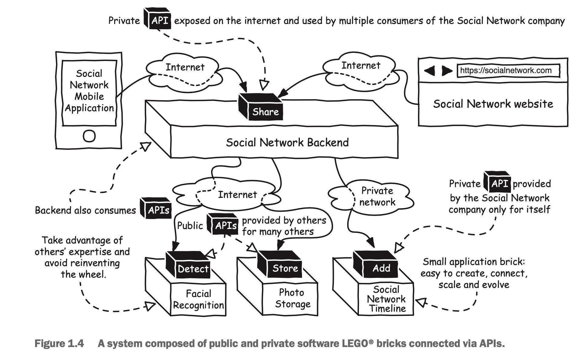

非常多的移动应用都是基于后端提供的API开发的，但不仅仅是看到的这样，网络API将软件变成可重复使用的易于组装的组件，从而释放出创造力和创新力。让我们回到一开始的例子去看看在社交网络分享图片会发生哪些事情。

当社交网络的后端接受到图片和信息之后，会优先存储接收到的图片，并且将信息和图片信息写到数据库里面。后端还有能力在存储图片之前，对照片进行面部算法识别，检测照片中的好友信息。而这仅仅是后端处理的冰山一角，后端还能为应用程序提供一切可能的计算。我们在图1.4中详细了解一下。

后端API能够同时为社交网络的移动应用和网站提供不同的基础能力，当后端接受到要分享的照片和信息时，可以通过API的形式委托第三方存储服务公司来存储，也可以通过API将信息和照片的委托给内部时间轴软件存储模块，那如何处理照片的面部识别呢？好吧，这可以委托一些面部识别专家通过......你猜对了......API提供服务。

注意图1.4为了使得图例更加容易理解，图中的每一个API都仅仅暴露出一个功能，而实际上一个API可以实现多种复杂的功能。例如，后台可以通过一个接口来获取实现添加好友、好友列表或者获取时间线的数据。

这看上去有点像是乐高的积木块，你可以用这些积木块组成任意你想要的东西，积木的可能组合是无穷的，而唯一的限制就是你自己的想象力。

在我还是个小孩子的时候，我经常花非常多的时间来用乐高积木拼装建筑物、汽车、植物、宇宙飞船等等所有我喜欢的东西。当我开始觉得拼装的玩具很无聊的时候，我就把它拆掉重新组装一个新的玩具，或者是将它变成其他玩具的组件，比如我曾经就把一些已经拼装好的玩具拼在一起制作了一个巨大的太空船。这跟API世界的运行原理是一样的：你可以将庞大的软件系统拆分成易于拼装的零部件，这些组件可以很容易地组装和替换，不过在实际操作中与乐高积木之间还是有一些细微的区别。

每一个软件的组件都是可以同时被多个其他模块调用的，例如，一个后端的API可以同时给移动应用和网站应用提供能力。一个API通常是面向多个消费者的，因此你不需要一直为需要的功能不停地编写新代码。