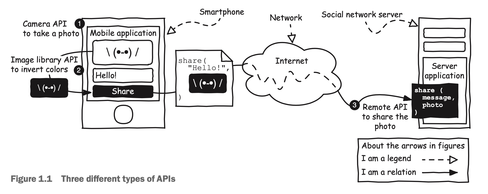

###  1.1 什么是API ？

现在全都数十亿人用自己的智能手机在社交网络中分享照片，但如果没有API的话，这种场景是完全无法实现的。使用手机在社交网络上面分享照片使用了非常多的不同的API。如图1.1所示。

首先，社交网络得移动应用程序通过调用智能手机的API来获取图片。然后，通过系统的API读取到图片库并对图片进行编辑。最后，通过调用服务器API把图片上传到服应用程序服务器中。一次图片的上传就涵盖了三种不同种类的API：系统API、硬件API以及远程API。本书主要是讲述的是远程API。

无论是哪种类型的API，都简化了软件的开发，但是远程API，特别是网络API，给开发软件提供了颠覆式的创新。现在，任何人都可以通过组装一系列的API的方式很容易地开发一套程序。但是我们在讨论API的无限可能前，本书会先讨论API实际上到底是什么。